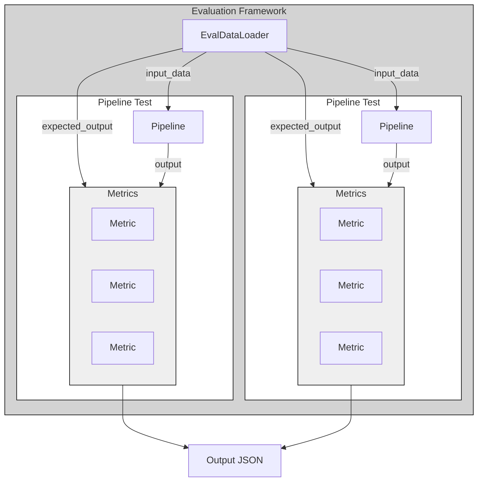

# lettuce-inspector
An evaluation for pipelines running Lettuce tasks.
[Lettuce](https://github.com/Health-Informatics-UoN/lettuce) is a tool assisting the assignment of OMOP codes to source terms.
The components of Lettuce's pipelines are made to be interchangeable, and different models benchmarked against a suite of Lettuce tasks.

## Architecture
A run of lettuce-inspector creates an experiment, or an `EvaluationFramework` object.
An `EvaluationFramework` consists of:

1. An `EvalDataLoader`, which loads data from some file and provides the `EvaluationFramework` with `input_data` and `expected_output`
2. A list of `PipelineTest`s

This is designed so that you can run a variety of pipelines against a single dataset, and these can be examined separately.

A `PipelineTest` consists of:

1. A `TestPipeline`, which reads the `input_data` provided to it, and returns some output
2. A list of `Metric`, which compare the output of a `TestPipeline` with `expected_output`

There are subtypes of `PipelineTest` which are meant to only accept the right subtypes of `TestPipeline` and `Metric` so that appropriate comparisons will be made.

